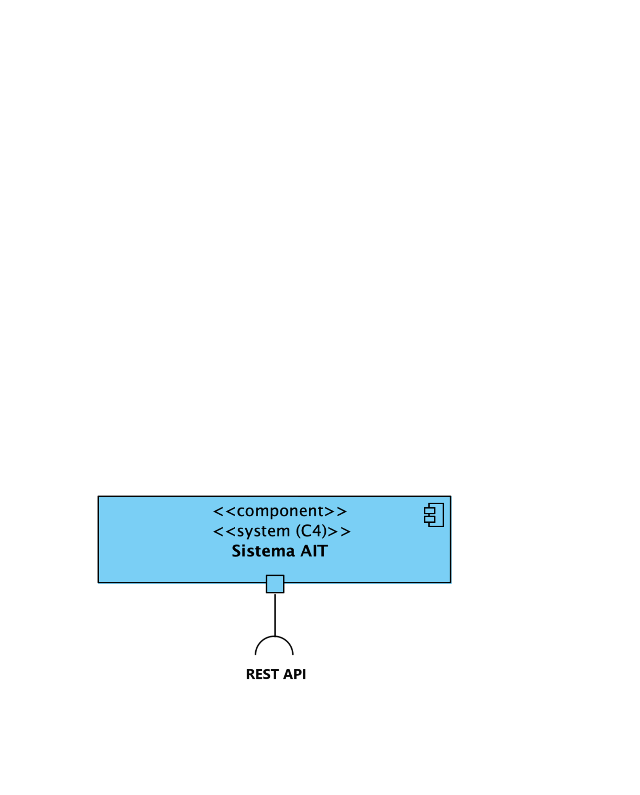
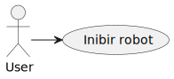
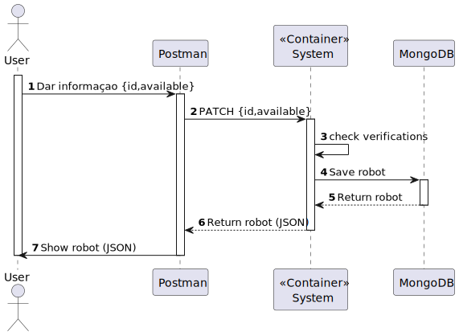
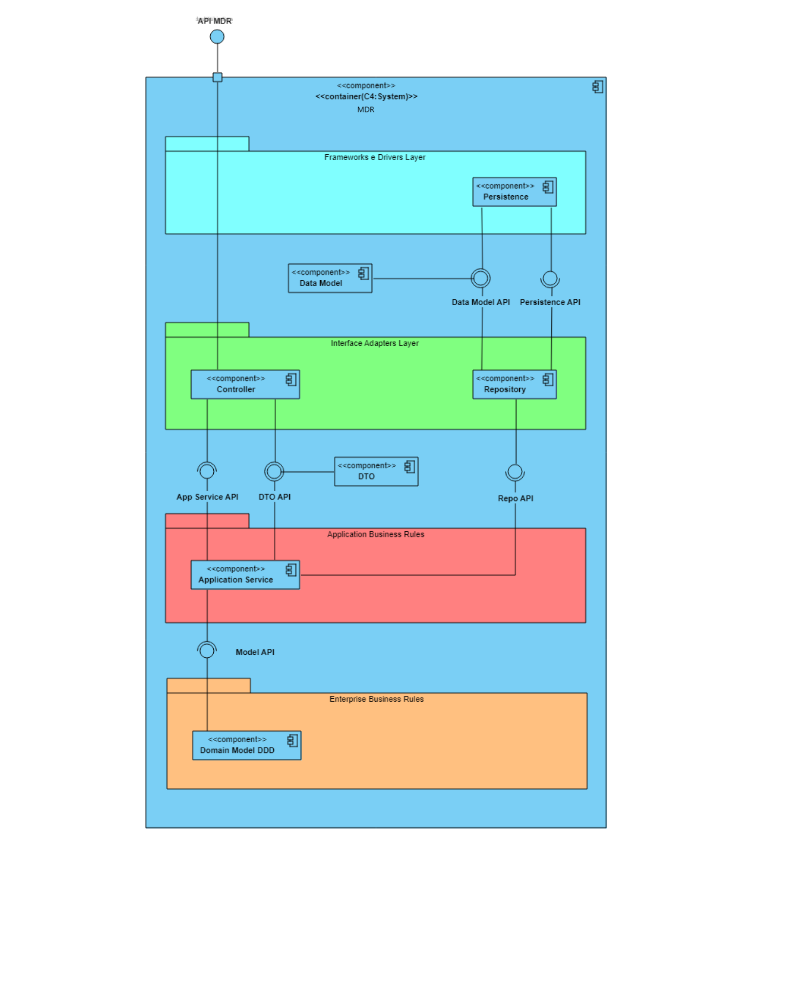
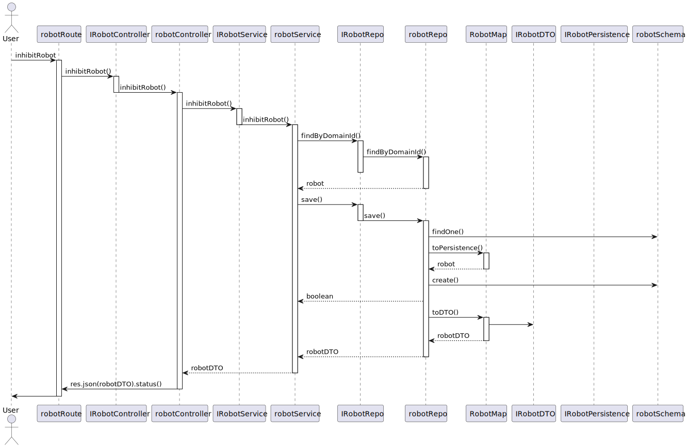

# US370 - Inibir robot
---

# Nível 1 - Vista Lógica

# Nível 1 - Vista de cenário

# Nível 2 - Vista de Processos

# Nível 3 - Vista Lógica

# Nível 3 - Vista de Processos

# Nível 3 - Vista de Implementação

