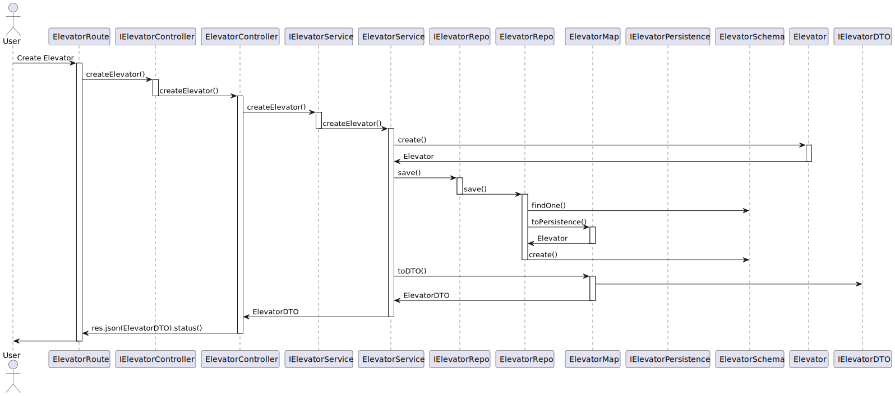

# US 270

## 1. Context

*This user story is being made for the first time*

## 2. Requirements

US270 - Criar elevador em edifício.*

*Regarding this requirement we understand that it relates to...*

## 3. Analysis

Para atender ao requisito da US270 de criar um elevador em um edifício, realizamos a seguinte análise:

- Identificamos que a criação de um elevador requer informações essenciais,como o id gerado pela base de dados quando o elevador é criado "domainId" como o "buildingName", um array(floors: string[]) com os andares associados ao elevador.

- Estudamos os requisitos do usuário para garantir que o processo de criação do elevador seja simples e eficiente.


## 4. Design

Para implementar a funcionalidade de criação de elevador, adotamos o seguinte design:

### 4.1. Realization
- Criamos um formulário de entrada de dados que permite ao usuário especificar o "buildingName" e os andares associados ao elevador.

- Implementamos uma camada de validação que verifica se o edifício existe no sistema e se os andares fornecidos estão associados ao edifício. Implementamos mais duas validações: uma para verificar se já existe algum elevador com o mesmo nome do edifício desejado, e a outra para analisar se já existe algum andar associado a outro elevador. Em caso de existência, a criação não será permitida..

- Desenvolvemos testes de unidade para validar a funcionalidade de criação do elevador, incluindo casos de teste para cenários válidos e inválidos.

### 4.2. Sequence Diagram



### 4.2. Class Diagram


### 4.3. Applied Patterns

### 4.4. Tests

**Test 1:** *Verifies that it is not possible to create an instance of the Example class with null values.*

```
@Test(expected = IllegalArgumentException.class)
public void ensureNullIsNotAllowed() {
	Example instance = new Example(null, null);
}
````

## 5. Implementation

*In this section the team should present, if necessary, some evidencies that the implementation is according to the design. It should also describe and explain other important artifacts necessary to fully understand the implementation like, for instance, configuration files.*

*It is also a best practice to include a listing (with a brief summary) of the major commits regarding this requirement.*

## 6. Integration/Demonstration

*In this section the team should describe the efforts realized in order to integrate this functionality with the other parts/components of the system*

*It is also important to explain any scripts or instructions required to execute an demonstrate this functionality*

## 7. Observations

*This section should be used to include any content that does not fit any of the previous sections.*

*The team should present here, for instance, a critical prespective on the developed work including the analysis of alternative solutioons or related works*

*The team should include in this section statements/references regarding third party works that were used in the development this work.*