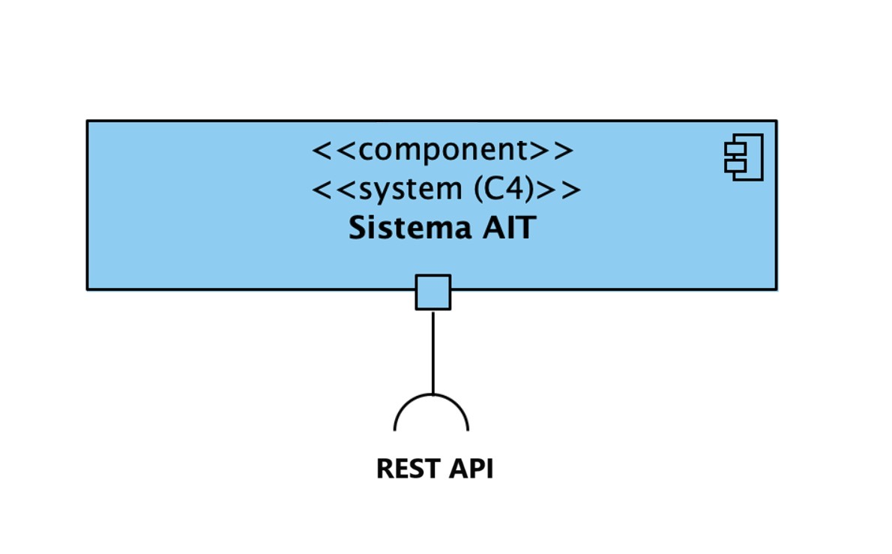
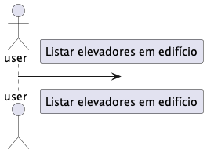
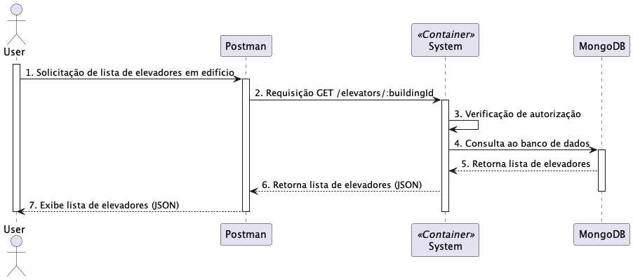
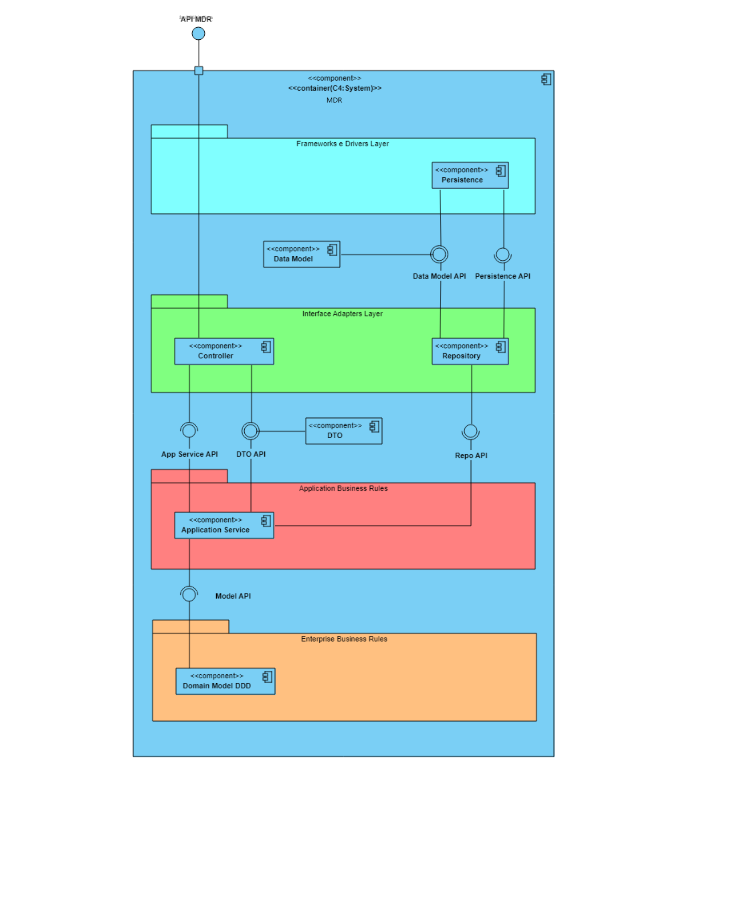
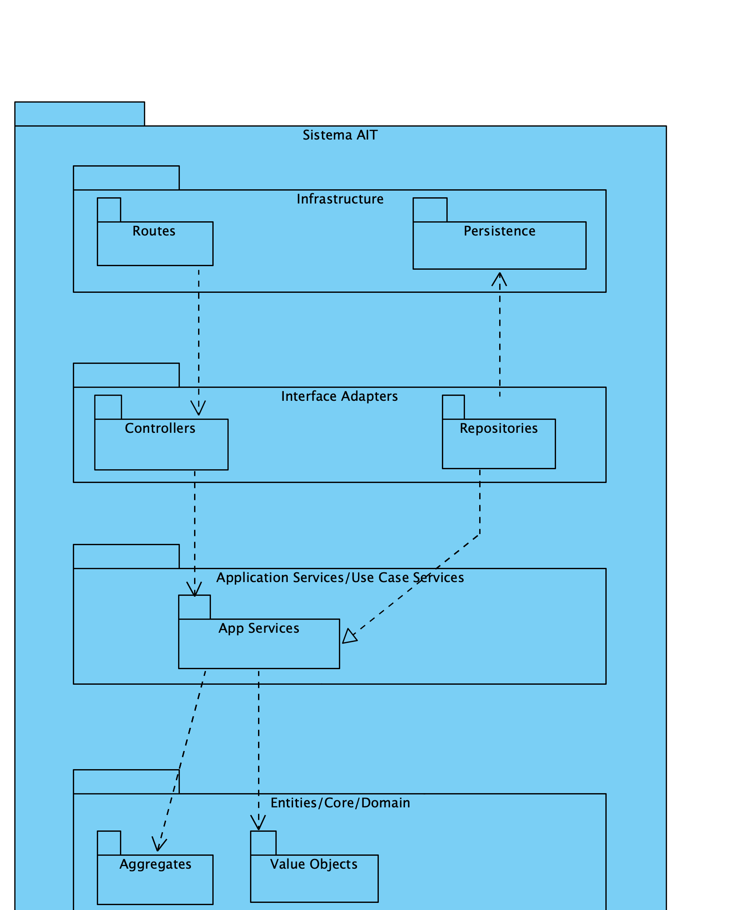
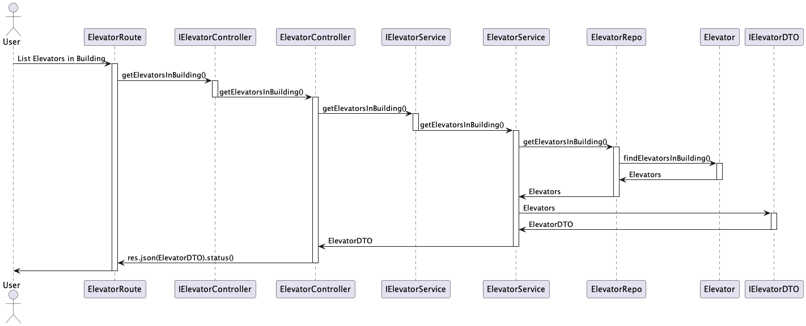

# US 290

## Requirements

US290 - Listar elevadores em edificio.

## Nível 1
**Vista Lógica**

**Vista Cenário**

## Nível 2

**Vista Processo**

### Nível 3
**Vista Lógica**

**Vista Implementação**

**Vista Processo**

