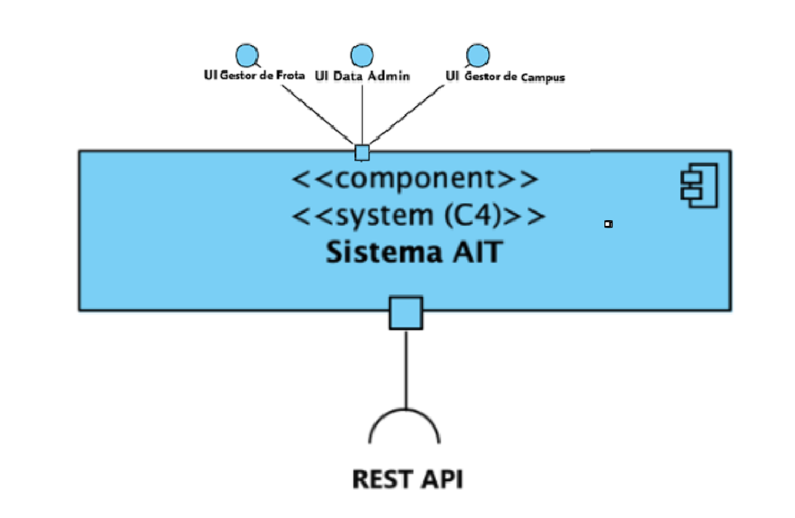

# US150 - Criar Edifício
---

# Nível 1 - Vista Lógica

# Nível 1 - Vista de cenário

# Nível 1 - Vista de Processos

# Nível 2 - Vista de Processos

# Nível 2 - Vista de Implementação

# Nível 2 - Vista Física

# Nível 2 - Vista Lógica

# Nível 3 - Vista Lógica

# Nível 3 - Vista de Processos

# Nível 3 - Vista de Implementação

