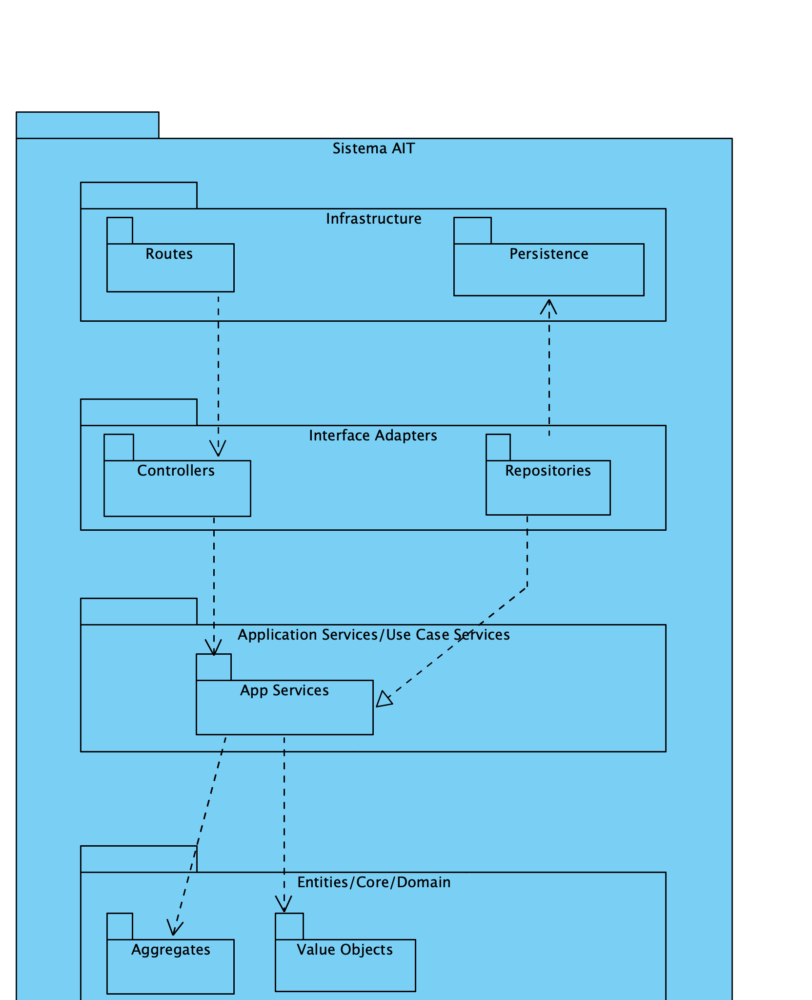

# US260 - Get Passagens
---

# Nível 1 - Vista Lógica

# Nível 1 - Vista de cenário

# Nível 1 - Vista de Processos

# Nível 2 - Vista de Processos

# Nível 2 - Vista Logica

# Nível 2 - Vista de Implementação

# Nível 2 - Vista  Física

# Nível 3 - Vista Lógica

# Nível 3 - Vista de Processos

# Nível 3 - Vista de Implementação

